# AeroQuantum-Wind — Current Data Flow Architecture

**Date**: 2026-10-06  
**Auditor**: Senior Wind-Farm GIS / Software Engineer  
**Document**: Runtime Data Flow Analysis & Dependency Graph

---

## 1. End-to-End System Pipeline

The diagram below maps the actual runtime execution path from the user's browser down to data providers, numerical engines, solvers, and WebGL rendering.

```mermaid
flowchart TD
    subgraph Frontend["Frontend Layer (React 18 + Vite + TypeScript)"]
        UI_Search["Location Search Input"]
        UI_S1["Screen 1: GIS Site Map (Leaflet)"]
        UI_S2["Screen 2: Farm Configuration"]
        UI_S3["Screen 3: Layout Analysis (Leaflet)"]
        UI_S4["Screen 4: WS-QAOA Convergence"]
        UI_S5["Screen 5: 3D Digital Twin (CesiumJS)"]
        UI_S6["Screen 6: Engineering Blueprint"]
        FE_Geom["Frontend geometry.ts (Warning: Client-side turbine generation)"]
    end

    subgraph API["Backend API Layer (FastAPI)"]
        API_Geocode["GET /api/geo/geocode"]
        API_Village["GET /api/geo/village-boundary"]
        API_Telem["GET /api/geo/telemetry"]
        API_Suitability["POST /api/geo/suitability/evaluate (Phase 3 Master Engine)"]
        API_LandData["GET /api/geo/land-data"]
        API_Feas["POST /api/geo/feasibility"]
        API_InitLayout["POST /api/geo/initial-layout"]
        API_OptA["POST /api/optimize (Legacy Path)"]
        API_OptB["POST /api/geo/qaoa-optimize (Engine Path)"]
        API_Tiles["GET /api/geo/tiles/{layer}/{z}/{x}/{y}"]
        API_SatStitch["GET /api/geo/site-imagery"]
        API_Projects["CRUD /api/projects"]
    end

    subgraph GIS_Data["GIS Data Ingestion & Physical Providers"]
        PROV_Nom["OpenStreetMap Nominatim API (Geocoding & Borders)"]
        PROV_Overpass["OpenStreetMap Overpass API (Buildings, Roads, Grid, Water)"]
        PROV_DEM["Copernicus DEM GLO-30m / Open-Meteo Elevation API"]
        PROV_NIWE["NIWE 120m Wind Potential Atlas / Tech Report 19"]
        PROV_WorldCover["ESA WorldCover 10m v200 Land Classification"]
        PROV_WDPA["UNEP-WCMC Protected Planet (WDPA v4)"]
        PROV_Wind["Open-Meteo Atmospheric Forecast API (100m Wind Speed/Dir)"]
        PROV_Soil["ISRIC SoilGrids 250m REST API (Clay, Sand, Silt, BDOD)"]
        PROV_Tiles["Esri World Imagery / Google Satellite Tiles"]
    end


    subgraph Storage["Persistence & Caching (SQLite)"]
        DB_Proj[("projects Table")]
        DB_DEM[("dem_cache Table")]
        DB_OSM[("osm_exclusion_cache Table")]
        DB_Hotspots[("india_wind_hotspots Table")]
        DISK_Tiles[("backend/data/tiles/ Disk Cache")]
    end

    subgraph Engineering["Engineering & Mathematical Modeling"]
        ENG_Geo["CandidateGenerationEngine (Grid sampling & Multi-stage filtering)"]
        ENG_Jensen["Jensen Kinematic Wake Model (core/aerodynamics.py)"]
        ENG_Floris["NREL FLORIS 4.x Bastankhah Gaussian Engine (floris_engine.py)"]
        ENG_AEP["AEP Climatological Integrator (16-sector wind rose + Weibull)"]
    end

    subgraph Optimization["Optimization Layer"]
        OPT_QUBO["Ising Cost Hamiltonian Builder (quantum_hamiltonian.py)"]
        OPT_WSQAOA["WS-QAOA Parameterized Quantum Circuit (core/wsqaoa.py)"]
        OPT_Relax["Continuous Relaxation (SLSQP / QP)"]
        OPT_Repair["Greedy 1-Opt Aerodynamic Repair (core/post_processor.py)"]
    end

    %% Wiring: Location Search
    UI_Search --> API_Geocode --> PROV_Nom
    UI_Search --> API_Village --> PROV_Nom

    %% Wiring: Telemetry & GIS Layers
    UI_S1 --> API_Telem --> PROV_Wind
    API_Telem --> PROV_DEM
    UI_S1 --> API_Tiles --> PROV_Tiles --> DISK_Tiles
    UI_S1 --> API_Feas --> ENG_Geo

    %% Data Providers to GIS Engine
    PROV_DEM --> DB_DEM --> ENG_Geo
    PROV_Overpass --> DB_OSM --> ENG_Geo
    PROV_Soil --> ENG_Geo
    PROV_WDPA --> ENG_Geo
    PROV_GWA --> ENG_Geo

    %% Layout Analysis Pipeline
    UI_S2 --> API_InitLayout --> ENG_Geo
    ENG_Geo --> ENG_Jensen
    ENG_Geo --> ENG_Floris
    API_InitLayout --> UI_S3

    %% Optimization Invocation Paths
    UI_S3 --> UI_S4
    UI_S4 --> API_OptA
    UI_S4 -.->|Alternative endpoint| API_OptB

    API_OptA --> ENG_Jensen
    API_OptA --> OPT_QUBO
    OPT_QUBO --> OPT_WSQAOA
    OPT_WSQAOA -->|If N <= 12| Qiskit_Sim["Qiskit Aer AerSamplerV2"]
    OPT_WSQAOA -->|If N > 12| OPT_Relax
    OPT_WSQAOA --> OPT_Repair
    OPT_Repair --> ENG_AEP
    API_OptA --> UI_S5

    API_OptB --> ENG_Geo
    ENG_Geo --> OPT_QUBO
    ENG_Geo --> OPT_Repair
    ENG_Geo --> ENG_Floris
    API_OptB --> UI_S5

    %% 3D Rendering
    UI_S5 --> API_SatStitch --> DISK_Tiles
    UI_S5 --> Model_GLB["/assets/models/wind_turbine.glb"]
    UI_S5 --> Cesium_Entities["Cesium Entities (Mast, Nacelle, 8.5D Wake Trapezoid)"]

    %% Blueprint Export
    UI_S5 --> UI_S6 --> API_Projects --> DB_Proj
```

---

## 2. Runtime Call Trace by Workflow Stage

### Stage 1: Location & Site Selection (`Screen1Site.tsx`)
1. **User Action**: Types a location name (e.g., "Bommuru", "Anantapur", "Kanyakumari"), clicks a map point, uses device GPS, or provides structured administrative/manual polygon inputs.
2. **Network Calls**:
   - `POST /api/geo/location/resolve`: Unified pipeline resolving geographic coordinates/administrative hierarchy and retrieving the validated Survey of India / advisory search envelope.
   - `GET /api/geo/village-boundary?q={query}&lat={lat}&lon={lon}`: Authoritative boundary endpoint. Queries Survey of India cadastral registry first; falls back to OpenStreetMap advisory polygon (`ADVISORY_ONLY`, `PARTIAL`). If unindexed, returns `UNAVAILABLE` with `geometry = None` (synthetic ovals eliminated).
   - `GET /api/geo/geocode?q={query}`: Nominatim geocoding with multi-match ambiguity detection.
   - `GET /api/geo/telemetry?lat={lat}&lon={lon}`: Open-Meteo European Centre (ECMWF) forecast API for 100m hub-height wind speed ($v_{100}$), direction ($\theta_{100}$), surface pressure, and temperature (flagged `SUITABLE_FOR_SIMULATION_ONLY`).
   - `GET /api/geo/soil-telemetry?lat={lat}&lon={lon}`: Queries ISRIC SoilGrids v2.0 REST API for bulk density and soil texture fractions (clay/sand/silt). Returns preliminary bearing capacity.
3. **Map Rendering & Geometry Invariants**:
   - Base satellite tiles loaded from `/api/geo/tiles/satellite/{z}/{x}/{y}` (proxied and cached on disk).
   - Administrative polygon boundary rendered with verified coordinates in WGS84, projected area ($m^2, km^2$) and perimeter computed via local UTM zone (EPSG:32642-46).
   - GPS point containment verified: if outside polygon, status returns `LOCATION_BOUNDARY_MISMATCH` with exact distance to boundary edge in metres.

### Stage 2: Configuration & Initial Layout (`Screen2Config.tsx` $\to$ `Screen3Layout.tsx`)
1. **User Action**: Selects turbine model (e.g. GE Vernova 2.5-120), turbine count ($K$), rotor diameter ($D$), hub height ($H$), and inter-turbine spacing ($5.0D$). Clicks "Generate Initial Layout".
2. **Network Call**:
   - `POST /api/geo/initial-layout` (or `POST /api/geo/feasibility`): Payload contains `center_lat`, `center_lon`, `boundary`, `turbine_count`, `rotor_diameter`, `spacing_multiplier_d`.
3. **Backend Processing (`CandidateGenerationEngine`)**:
   - **Step A (Grid Generation)**: Generates scale-adaptive regular metric candidate points within the parcel bounding box ($60\,\text{m}\text{--}300\,\text{m}$ step).
   - **Step B (Boundary Clipping)**: Ray-casting point-in-polygon test filters out exterior candidates.
   - **Step C (Setback Clipping)**: Distance-to-boundary test removes candidates within $0.5D$ ($60\,\text{m}$).
   - **Step D (OSM Exclusion Filter)**: Evaluates Euclidean distance to OSM buildings ($\ge 500\,\text{m}$), highways ($\ge 100\,\text{m}$), powerlines ($\ge 150\,\text{m}$), waterways ($\ge 120\,\text{m}$).
   - **Step E (Slope Filter)**: Rejects candidates where slope gradient exceeds $16.0^\circ$ (computed via Copernicus DEM kernel).
   - **Step F (Spatial Thinning)**: Uses `scipy.spatial.cKDTree` to thin candidate density while preserving wind resource ranking.
4. **Layout Simulation**:
   - Jensen wake matrix $W_{ij}$ and NREL FLORIS 4.x wake simulation compute baseline Gross AEP, Net AEP, and wake loss %.
5. **Frontend Rendering (`Screen3Layout.tsx`)**:
   - Displays candidate grid dots and active turbine markers.
   - Renders 2D wake plumes aligned with prevailing wind direction.

### Stage 3: Quantum WS-QAOA Optimization (`Screen4Optimize.tsx`)
1. **User Action**: Clicks "Run Quantum Optimization".
2. **Network Call**:
   - Frontend calls `POST /api/optimize` via `src/services/api.ts:runOptimization()`.
   - Payload: `{ sites: [{id, lat, lon, x_m, y_m}], K: 12, wind_angle_deg: 270, p: 2 }`.
3. **Backend Thread Execution (`_sync_optimize_worker`)**:
   - Calculates $N \times N$ pairwise Jensen velocity deficit matrix $W_{ij}$.
   - Constructs Ising cost Hamiltonian parameters $(h_i, J_{ij})$:
     - Linear coefficients: $h_i = -\frac{c_i}{2} - \frac{1}{4} \sum_{j \neq i} Q_{ij}$
     - Quadratic coupling: $J_{ij} = \frac{Q_{ij}}{4}$
     - Penalty parameter $\lambda_{\text{turb}} = 1.5 \cdot \max_{i,j} |W_{ij}|$
   - **Solver Dispatch**:
     - If $N \le 12$: Builds parameterized $p=2$ Qiskit circuit with continuous warm-start $R_Y(\theta_i)$, $R_{ZZ}(2\gamma J_{ij})$ cost unitaries, and Givens $XY$ mixers. Optimizes $(\gamma, \beta)$ parameters using SciPy COBYLA over Qiskit Aer statevector simulation.
     - If $N > 12$: Automatically switches to continuous relaxation $c^* \in [0, 1]^N$ followed by greedy 1-opt repair.
   - **Greedy Repair**: Enforces strict Hamming weight $\sum x_i = K$ by adding/removing turbines based on marginal wake penalties.
   - **Telemetry Assembly**: Evaluates Net AEP (GWh), wake loss %, and estimated revenue (Crore INR). Generates unique HTML blueprint and caches in `JOB_STORE`.

### Stage 4: 3D Geospatial Digital Twin Inspection (`Screen5Inspect.tsx`)
1. **User Action**: Inspects optimized layout; toggles "3D Digital Twin View".
2. **CesiumJS Initialization (`CesiumGlobeView.tsx`)**:
   - Mounts Cesium WebGL viewer with terrain depth testing and atmospheric fog.
   - Fetches stitched high-definition satellite terrain texture via `/api/geo/site-imagery?lat={lat}&lon={lon}&zoom=14&grid_radius=2`. Drapes texture over site rectangle.
   - Loads binary GLTF wind turbine model `/assets/models/wind_turbine.glb`.
   - Instantiates procedural structural components:
     - Vertical monopile cylinder ($H = 110\,\text{m}$, top radius $1.8\,\text{m}$, bottom radius $3.4\,\text{m}$).
     - Reinforced concrete foundation cylinder pad ($R = 16\,\text{m}$).
     - Nacelle housing box ($12\,\text{m} \times 4.2\,\text{m} \times 4.2\,\text{m}$).
     - Hub telemetry floating billboard tag.
   - **Yaw Orientation**: Calculates upwind heading:
     $$\theta_{\text{yaw}} = (\theta_{\text{wind}} - 90^\circ + 360^\circ) \bmod 360^\circ$$
     ensuring rotor faces directly into oncoming atmospheric wind.
   - **Wake Plume Drapery**: Projects 4-vertex horizontal Jensen wake footprint ($8.5D$ length) expanding downstream.

---

## 3. Critical Data Provenance Discrepancies

| Data Field | Reported in UI | Actual Backend Source | Severity | Impact |
|------------|----------------|-----------------------|----------|--------|
| Surface Elevation | Copernicus DEM GLO-30 | Open-Meteo Elevation API (Copernicus 30m / SRTM) | Low | Accurate elevations, cached locally. |
| Wind Telemetry | ECMWF / Open-Meteo 100m | Open-Meteo Forecast API (`wind_speed_100m`) | Low | Authentic atmospheric data. |
| Climatological Wind | Global Wind Atlas 3.0 | Static Python `if/elif` regional rules | **HIGH** | Does not reflect true mesoscale variations. |
| Land Classification | ESA WorldCover 10m | Static heuristics based on latitude bands | **HIGH** | False sense of satellite land-use clearance. |
| Protected Areas | UNEP-WCMC WDPA v4 | Static array of 10 park coordinates | **HIGH** | Unscreened wildlife corridors and forest reserves. |
| Optimization State | Quantum WS-QAOA | Qiskit Aer ($N \le 12$) / Classical Relaxation ($N > 12$) | **HIGH** | Classical relaxation masquerading as quantum solution on realistic farm sizes ($N > 12$). |
